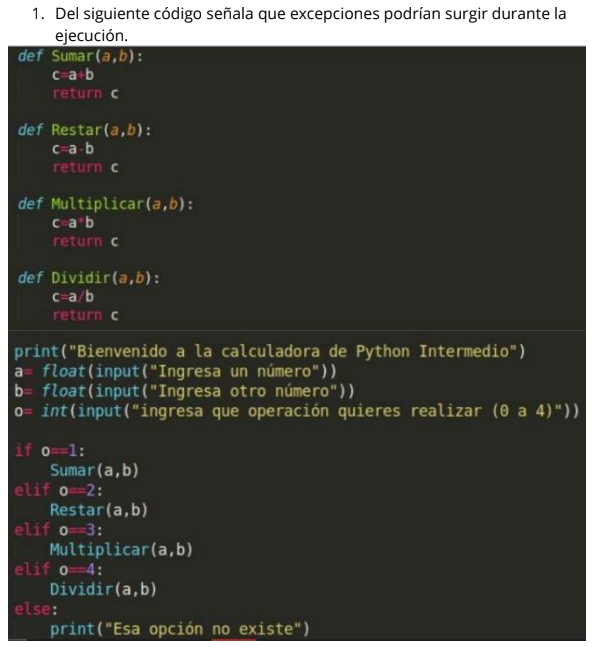

# Tarea 1 - Excepciones

# Excepciones identificadas
- ValueError 
    - Esto es debido a que se podría ingresar una letra en vez de un número para realizar las operaciones matemáticas del programa, lo cual nos impediría castear la string recibida en el input a entero.

- ArithmeticError
    - Esto es debido a que podría surgir un error durante la realización de las operaciones aritméticas, tales como:
        - [OverflowError](https://docs.python.org/3/library/exceptions.html#OverflowError)
        - [ZeroDivisionError](https://docs.python.org/3/library/exceptions.html#ZeroDivisionError)
        - [FloatingPointError](https://docs.python.org/3/library/exceptions.html#FloatingPointError)
